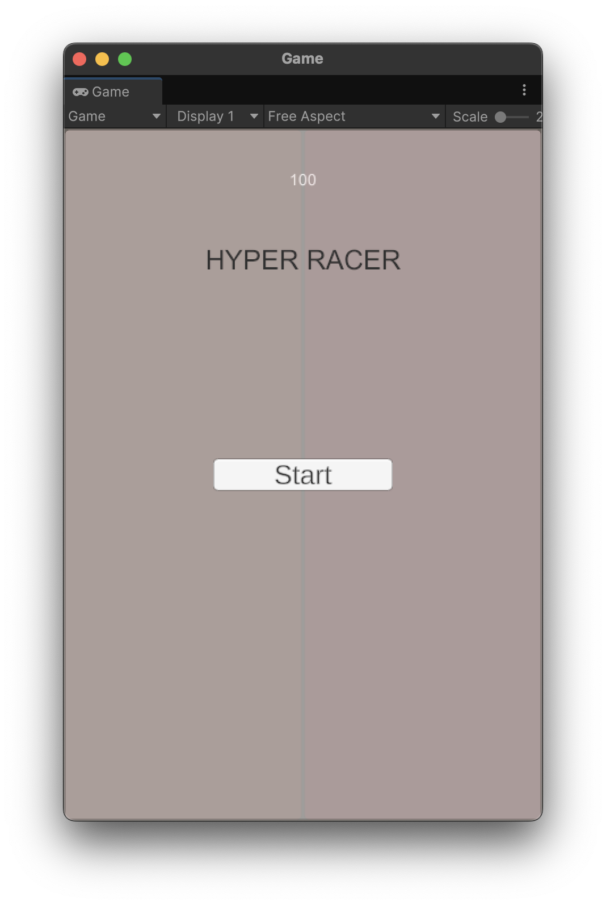
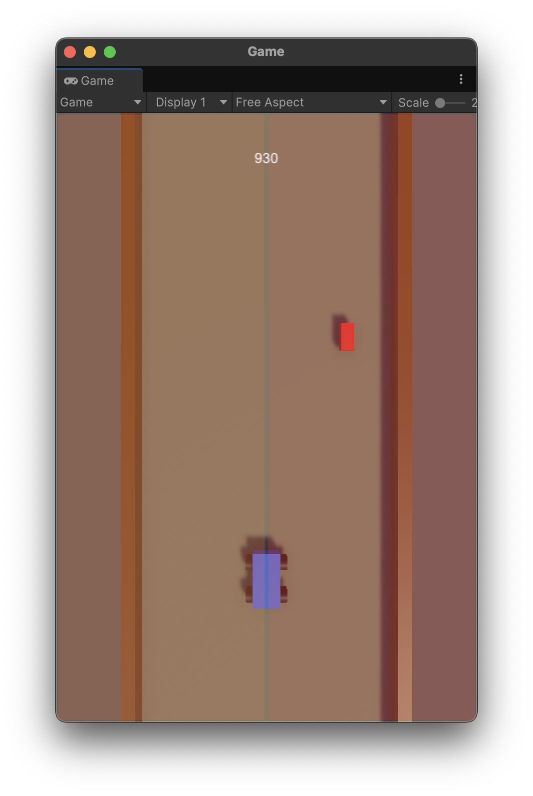
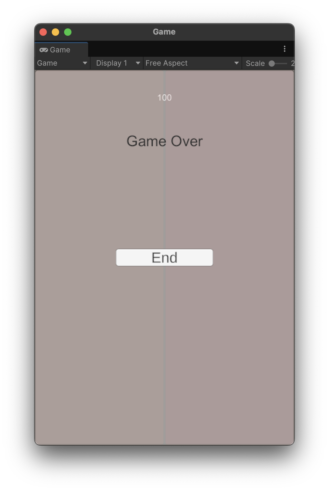
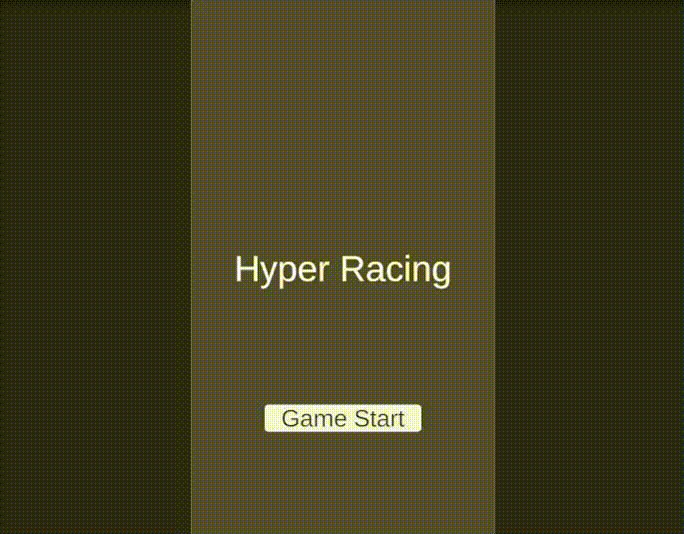

# 게임 과제

## 1. 게임 시작 패널

게임이 실행되면 **"게임 시작" 패널**이 나타납니다.  
화면에서 **"게임 시작" 버튼**을 클릭하면 게임이 시작됩니다.

## 2. 게임 플레이

### 2-1. 주행

게임이 시작되면 자동차가 앞으로 달려갑니다.  
자동차가 실제로 달려갈 필요는 없습니다. 단지 자동차가 달려가는 형태를 표현하면 됩니다.  
화면의 **왼쪽을 터치**하면 자동차는 왼쪽으로 이동하고, **오른쪽을 터치**하면 오른쪽으로 이동합니다.

### 2-2. 가스 아이템

도로에는 **가스 아이템**이 존재합니다. 이 가스 아이템은 자동차와 충돌하면 차량의 **gas가 30 증가**합니다.  
가스 아이템은 **도로의 중앙, 왼쪽, 오른쪽** 3 군데 중에서 한 곳에 랜덤하게 나타납니다.

## 3. 가스

자동차는 게임 시작 시 **100의 gas**를 가지고 있습니다.  
자동차는 **1초에 1unit 이동**하며 1unit 이동할 경우 **10 gas**를 소모합니다.  
자동차의 **gas**가 0이 되면 게임은 종료됩니다.

## 4. 게임 종료 패널

게임이 종료되면 **게임 종료 패널**이 나타납니다.  
게임 종료 패널에는 **"게임 종료" 버튼**이 있고 해당 버튼을 클릭하면 다시 게임의 시작으로 돌아갑니다.

## 5. 제출

- 제출은 **Github**에 **공개 저장소**를 만들어 배포하고, Github 주소를 제출합니다.
- 과제 제출 기간은 **2025년 1월 22일**까지입니다.

